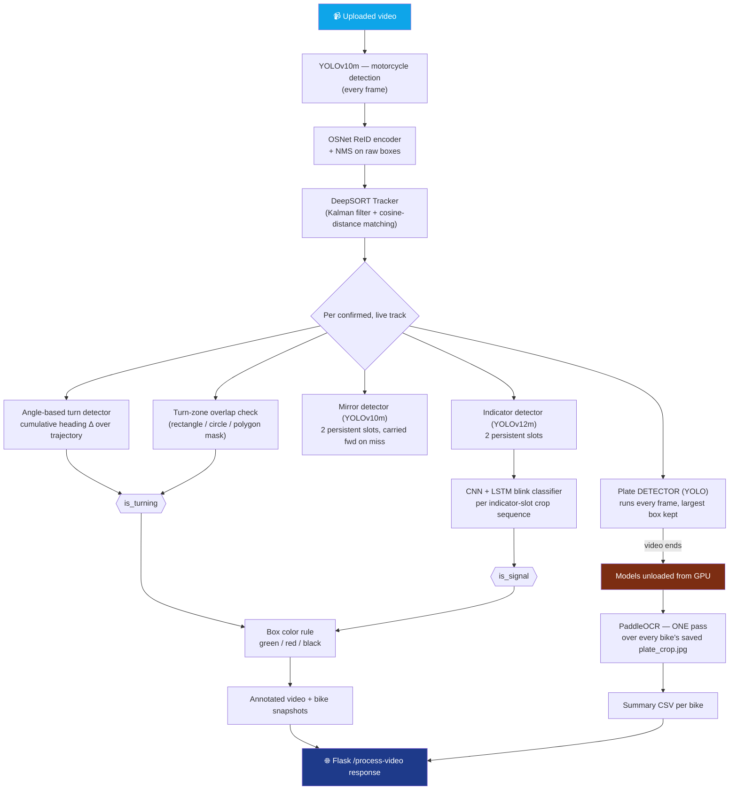

<div align="center">


<br/>

<a href="#">
  
</a>

<br/><br/>


</div>

<br/>

> [!NOTE]
> This is a **Google Colab–first research/prototype pipeline** — paths like `/content/deepSort`, `/content/drive/MyDrive/...` are hardcoded throughout, weights are pulled from a mounted Google Drive, and the API is exposed to the internet via an **ngrok** tunnel. It is not (yet) a pip-installable package or a Docker service — see [Running It](#-running-it-current-colab-workflow) for the real setup steps used in this repo.

<br/>

## 🎯 What this pipeline actually does

A video comes in → every motorbike gets tracked frame-by-frame with DeepSORT → for each tracked bike it **locates and OCRs the number plate**, **decides whether the bike is turning** (by trajectory angle *and/or* a drawn junction zone), and **classifies whether its turn-signal indicator is blinking** while it turns → everything is written back out as an annotated video, per-bike snapshot images, and a summary CSV — served over a small Flask API.

<div align="center">
<table>
<tr>
<td align="center" width="20%">🏍️<br/><b>DeepSORT + OSNet ReID</b><br/><sub>per-bike tracks, not just boxes</sub></td>
<td align="center" width="20%">🔢<br/><b>2-Stage Plate Pipeline</b><br/><sub>YOLO detect every frame · PaddleOCR once, at the end</sub></td>
<td align="center" width="20%">💡<br/><b>Turn-Signal Classifier</b><br/><sub>CNN+LSTM on indicator-light crops</sub></td>
<td align="center" width="20%">🚦<br/><b>Turn Detection</b><br/><sub>cumulative heading angle OR junction-zone overlap</sub></td>
<td align="center" width="20%">☁️<br/><b>Colab + ngrok API</b><br/><sub>Flask, per-video output folders</sub></td>
</tr>
</table>
</div>

<div align="center">

</div>

<br/>

## 🧠 Architecture — what actually runs, in order



<br/>

## ✨ Feature Breakdown (from the actual code)

<details open>
<summary><b>🏍️ Tracking core — <code>track.py</code></b></summary>
<br/>

Each `Track` object is far more than a bounding box — it's a small state machine that lives for the bike's whole time on screen:

- **Lifecycle**: `Tentative → Confirmed → Deleted`, governed by `n_init` (confirm after N hits) and `max_age` (drop after N missed frames)
- **Turn detection** (`detect_turn`) — smooths the trajectory with a 5-point moving average, computes frame-to-frame heading deltas, and sums their absolute value into a **cumulative angle change**; combined with the bike's accumulated `side` / `front-back` orientation votes to decide `is_turning`
- **Persistent mirror & indicator slots** — two independent left/right slots each, matched frame-to-frame by nearest position so a box can never "hop" identity. When a detector misses a frame, the slot's last-known box is **carried forward by the bike's own motion** instead of vanishing — keeps "has both mirrors" from flickering on one bad frame
- **Sticky lifetime facts** — `mirror_seen_both`, `indicator_seen_both`, `ever_turned`, `ever_signaled_while_turning` — once true, stay true, so a single confident frame is enough to record the fact for the final CSV row
- **Best-image tracking** — keeps only the single *largest-ever* crop of the bike (plus the full frame it came from), since a small/far/blurry crop can't produce a readable plate anyway
- **`update_box_color()`** — single source of truth: not turning → green, turning without signal → red, turning with signal → black

</details>

<details>
<summary><b>🔢 Plate detection & OCR — <code>plate_detector.py</code></b></summary>
<br/>

- **Deliberately split in two**: the plate **detector** (YOLO, class-filtered by `PLATE_CLASS_ID`) runs every frame on every live bike crop; **OCR** (PaddleOCR) runs only once per bike, at the very end, on the biggest plate crop that detector ever found — `detect_plates_in_bike_crop(..., use_ocr=False)` vs `read_plate_text_from_image(...)`
- **Safety net against a wrong class ID**: any "plate" box covering more than `PLATE_MAX_AREA_RATIO` (40%) of the bike crop is rejected outright — this is what stops the whole bike from ever being saved as a "plate" if `PLATE_CLASS_ID` is misconfigured
- **PaddleOCR is forced onto CPU on purpose** (`device="cpu", cpu_threads=1`) — running it on GPU alongside PyTorch in the same process was causing silent hangs from a CUDA-context conflict; a `_Watchdog` timer logs a warning (without killing anything) if OCR init takes suspiciously long
- `debug=True` streams intermediate crops inline (Colab-safe `cv2_imshow`, matplotlib elsewhere) at every stage — detection input, OCR input, and every rejected/accepted box

</details>

<details>
<summary><b>💡 Turn-signal blink classifier — <code>blink_model.py</code></b></summary>
<br/>

This model does **not** look at the rider's eyes — it watches the cropped **indicator light** over time and classifies whether it's actively blinking (signaling) or not, per left/right slot:

**CNN backbone → Sequence head → FC classifier**, fully swappable via one config:

| Component | Options |
|---|---|
| CNN backbone | Any `torchvision.models` classifier (ResNet18 in the current weights) |
| Sequence head | `LSTM` · `GRU` · `BiLSTM` · `RNN` · `Transformer` (registry-based, add your own in one line) |
| Input | Up to 30 stored 64×64 crops per indicator slot, fed through the CNN then pooled by the sequence head into one embedding |

```python
from blink_model import build_model, load_weights, ModelConfig

cfg = ModelConfig(cnn_name="resnet18", seq_type="LSTM",
                   num_layers=2, hidden_size=256, dropout=0.5)
model = build_model(cfg)
model = load_weights(model, "best_model.pth", device="cuda")
logits = model(indicator_crop_sequence, lengths)   # -> signal ON / OFF per slot
```

The per-slot prediction feeds `slot["is_signal"]`, which rolls up into the bike-level `is_signal` flag used by the turn/color logic above.

</details>

<details>
<summary><b>🚦 Junction zones & the Flask API — <code>backend_server.py</code></b></summary>
<br/>

- `POST /process-video` accepts a video plus `mode: "direct" | "junction"`. In `direct` mode, `TURN_ZONES = []` and turning is decided by the angle detector alone. In `junction` mode, the frontend's drawn **rectangles / circles / polygons** are converted into the zone format `deepsortVideo.build_zone_mask()` rasterizes — zone overlap is an **OR**, not a replacement, for the angle detector
- Every processed video gets its **own folder** named after the *original* filename — re-uploading the same name overwrites that folder instead of piling up next to it:
  ```
  output_public/<video_base>/
    annotatedvideo.mp4
    <video_base>_bikes.csv
    bikes/<track_id>/annotated_frame.jpg
    bikes/<track_id>/plate_crop.jpg   # only if a plate was actually located
  ```
- `/outputs/...` and `/snapshots/...` serve that folder statically; `/videos` lists everything processed so far, sorted by **upload** time (not by how long processing took); a `manifest.json` on disk backs all of it
- The summary CSV is parsed straight into the JSON response (`data.logs`) so the frontend never has to touch the filesystem

</details>

<br/>

## 📁 Files in this repo

```
safe-ride-vision/
├── deepsortVideo.py      # Orchestrator: loads all models, runs the per-frame loop, writes CSV
├── track.py              # DeepSORT Track object — turn/mirror/indicator/plate state machine
├── plate_detector.py     # Plate YOLO detector + PaddleOCR (2-stage, detect-then-OCR)
├── blink_model.py         # CNN + Sequence hybrid — turn-indicator blink classifier
├── backend_server.py     # Flask + ngrok API (/process-video, /outputs, /snapshots, /videos)
└── Safe_Ride_vision_bankend_server.ipynb   # Colab notebook that sets everything up and runs it
```

<br/>

## ⚙️ Models this pipeline loads (all external weights, not in this repo)

| Model | Purpose | Framework |
|---|---|---|
| `yolov10m.pt` | Motorcycle detection | Ultralytics YOLO |
| Custom OSNet (`osnet_x1_0`) checkpoint | Bike re-identification embeddings for DeepSORT | torchreid |
| `bestM.pt` | Mirror detection | Ultralytics YOLO |
| Custom indicator YOLOv12m weights | Indicator (turn-signal) detection | Ultralytics YOLO |
| Orientation detector `.pt` | Side / front-back orientation voting | Ultralytics YOLO |
| `best_model.pth` | Turn-signal blink classification | PyTorch (this repo's `blink_model.py`) |
| Plate detector `.pt` | Number-plate localization | Ultralytics YOLO |
| PaddleOCR (`en`, det+rec only) | Reading plate text | PaddlePaddle |

<br/>

## ▶️ Running it (current Colab workflow)

This is exactly the sequence the included notebook runs — there's no `pip install -r requirements.txt` + `python app.py` flow yet:

1. Mount Google Drive and unzip the project bundle (`Safe-ride-v.zip`) into `/content/`
2. Copy the model weights and the patched `track.py` into the cloned `deep_sort/` package
3. `pip install ultralytics`, clone + `pip install -e .` on `deep-person-reid` (torchreid), then `pip install flask flask-cors pyngrok paddlepaddle paddleocr`
4. Set an ngrok authtoken and run `python backend_server.py`
5. ngrok prints a public URL — that's what the frontend's `api.js` points at

> [!WARNING]
> The uploaded notebook has an **ngrok authtoken hardcoded in plain text** in two cells. Rotate/revoke that token and load it from Colab's Secrets (`userdata.get(...)`) or an environment variable instead of committing it — anyone with that string can open tunnels on your ngrok account.

**API contract**

```http
POST /process-video
Content-Type: multipart/form-data

video            → the video file
mode             → "direct" | "junction"
fps              → float            (junction mode only)
junction_count   → int              (junction mode only)
junctions        → JSON array of {shape, box, points}   (junction mode only)
```

```json
{
  "output_video_url": "/outputs/<video_base>/annotatedvideo.mp4",
  "logs": [ { "bike_id": "3", "plate_number": "ABC123", "has_both_mirrors": "True",
              "has_both_indicators": "True", "took_turn": "True",
              "indicator_on_while_turning": "False" } ],
  "snapshots_url": "/snapshots/<video_base>/bikes"
}
```

<br/>

## 🗺️ Honest roadmap

- [x] Multi-object tracking with sticky per-track mirror/indicator/turn facts
- [x] Detect-every-frame, OCR-once plate pipeline (fixes the PaddleOCR/CUDA hang)
- [x] Swappable CNN+sequence turn-signal blink classifier
- [x] Angle-based **and** drawn-junction-zone turn detection (OR logic)
- [ ] Package as pip-installable / containerized service (currently Colab-path-hardcoded)
- [ ] Move the ngrok token out of the notebook and into a secret manager
- [ ] Optical flow was removed (RAFT was OOM-ing on a shared T4) — `bike_flow_stats()` currently always returns zeros; a classical CPU method (e.g. Farneback) is the noted path back in
- [ ] Live RTSP / streaming input instead of upload-a-file-then-wait

<br/>

<div align="center">


</div>
