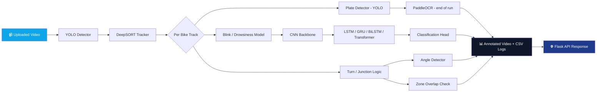

<div align="center">


<br/>

<a href="#">
  
</a>

<br/><br/>


</div>

<br/>

## 🎯 What is Safe Ride Vision?

> A real-time computer-vision pipeline that watches traffic footage, tracks every motorbike frame-by-frame, reads number plates automatically, detects drowsy/blinking riders, and flags illegal turns at junctions — all packaged behind a simple video-upload API.

<div align="center">
<table>
<tr>
<td align="center" width="20%">🏍️<br/><b>Multi-Object Tracking</b><br/><sub>DeepSORT + Kalman Filter</sub></td>
<td align="center" width="20%">🔢<br/><b>Plate Recognition</b><br/><sub>YOLO detector + PaddleOCR</sub></td>
<td align="center" width="20%">😴<br/><b>Drowsiness Detection</b><br/><sub>CNN + LSTM/GRU/Transformer</sub></td>
<td align="center" width="20%">🚦<br/><b>Turn Violation Logic</b><br/><sub>Angle + Zone detection</sub></td>
<td align="center" width="20%">☁️<br/><b>Cloud-Ready Backend</b><br/><sub>Flask + ngrok / Colab</sub></td>
</tr>
</table>
</div>

<br/>

<div align="center">

</div>

## 🧠 Architecture



<br/>

## ✨ Feature Breakdown

<details open>
<summary><b>🏍️ Tracking Engine — <code>track.py</code> / <code>deepsortVideo.py</code></b></summary>
<br/>

- Classic **DeepSORT** track lifecycle: `Tentative → Confirmed → Deleted`
- Kalman-filter based motion prediction with `(x, y, aspect_ratio, height)` state space
- Robust exception logging per track ID so silent crashes never go unnoticed
- Full per-video pipeline: detection → tracking → plate crop → blink check → turn check → CSV export

</details>

<details>
<summary><b>🔢 Plate Detection & OCR — <code>plate_detector.py</code></b></summary>
<br/>

- **Split-stage design**: plate *detection* (YOLO) runs every frame; **OCR** (PaddleOCR) runs once at the end on cropped plates only — huge speed win
- `debug=True` mode streams live intermediate images (Colab-safe via `cv2_imshow`, matplotlib fallback elsewhere)
- Threading watchdog warns if any OCR call hangs — guards against PaddlePaddle's known CPU-inference deadlock
- `warm_up_plate_detector()` / `warm_up_ocr()` for zero cold-start latency mid-run

</details>

<details>
<summary><b>😴 Drowsiness / Blink Classifier — <code>blink_model.py</code></b></summary>
<br/>

A fully modular **CNN → Sequence Model → FC Head** hybrid:

| Component | Options |
|---|---|
| CNN Backbone | Any `torchvision.models` classifier (ResNet18 default) |
| Sequence Head | `LSTM` · `GRU` · `BiLSTM` · `RNN` · `Transformer` |
| Config | Single `ModelConfig` dataclass — swap architectures with one line |

```python
from blink_model import build_model, ModelConfig

cfg = ModelConfig(cnn_name="resnet18", seq_type="LSTM",
                   num_layers=2, hidden_size=256, dropout=0.5)
model = build_model(cfg)
logits = model(video_batch, lengths)
```

</details>

<details>
<summary><b>🚦 Junction & Turn Violation Logic — <code>backend_server.py</code></b></summary>
<br/>

- Two operating modes: **`direct`** (angle-detector only) and **`junction`** (angle detector **OR** polygon zone overlap)
- Frontend-drawn rectangles / circles / polygons are rasterized into `TURN_ZONES` automatically
- Every processed video gets its **own output folder** — re-uploading the same filename cleanly overwrites instead of piling up
- Per-bike snapshots (`annotated_frame.jpg`, `plate_crop.jpg`) served directly over static routes

</details>

<br/>

## 📁 Project Structure

```
safe-ride-vision/
├── 🎥 deepsortVideo.py      # Main pipeline orchestrator (detect → track → analyze)
├── 🧭 track.py              # DeepSORT track state machine
├── 🔢 plate_detector.py     # Plate YOLO detector + PaddleOCR module
├── 👁️  blink_model.py        # CNN + Sequence hybrid drowsiness classifier
├── 🌐 backend_server.py     # Flask + ngrok inference API
└── 📓 *.ipynb               # Colab notebook entry point
```

<br/>

## 🚀 Quick Start

```bash
# 1. Clone the repo
git clone https://github.com/your-org/safe-ride-vision.git
cd safe-ride-vision

# 2. Install dependencies
pip install -r requirements.txt

# 3. Launch the backend (Colab or local GPU box)
python backend_server.py
```

**API Contract**

```http
POST /process-video
Content-Type: multipart/form-data

video            → the video file
mode             → "direct" | "junction"
fps              → float            (junction mode only)
junction_count   → int              (junction mode only)
junctions        → JSON array       (junction mode only)
```

```json
{
  "output_video_url": "/outputs/<file>.mp4",
  "logs": [ { "frame_idx": 0, "track_id": 1, "cx": 320, "cy": 180 } ]
}
```

<br/>

## 🛠️ Tech Stack

<div align="center">


</div>

<br/>

## 🗺️ Roadmap

- [x] Real-time multi-object tracking with DeepSORT
- [x] Plate detection + delayed-batch OCR for speed
- [x] Modular blink/drowsiness classifier with swappable sequence heads
- [x] Junction zone + angle-based turn violation detection
- [ ] Live RTSP stream support
- [ ] Edge-device (Jetson) deployment
- [ ] Web dashboard for live analytics

<br/>

<div align="center">

### 💙 Built for safer roads


</div>
